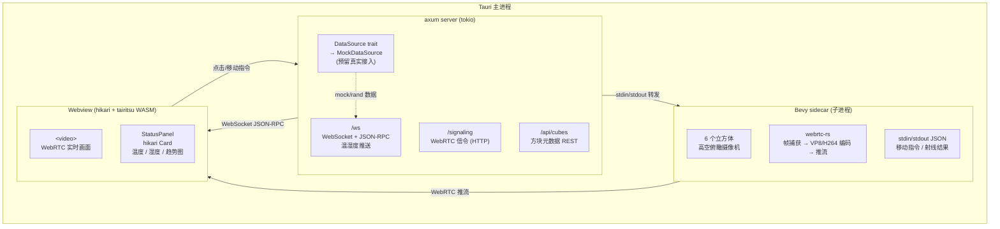
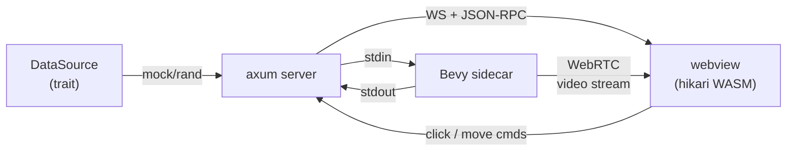
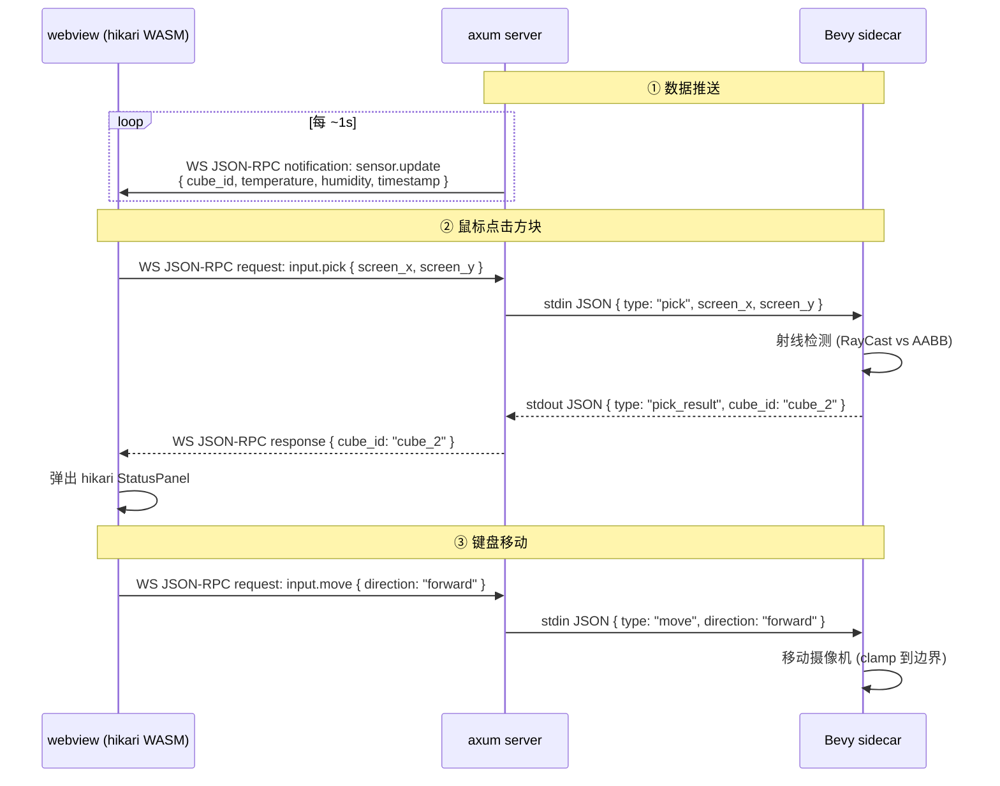
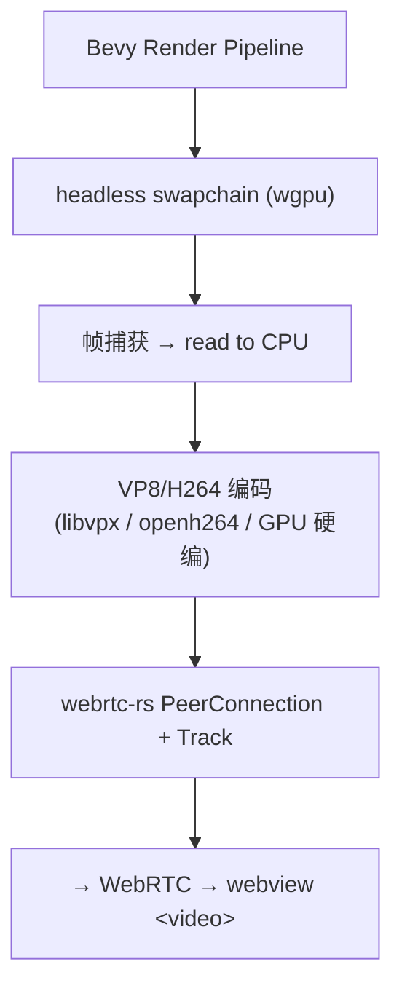
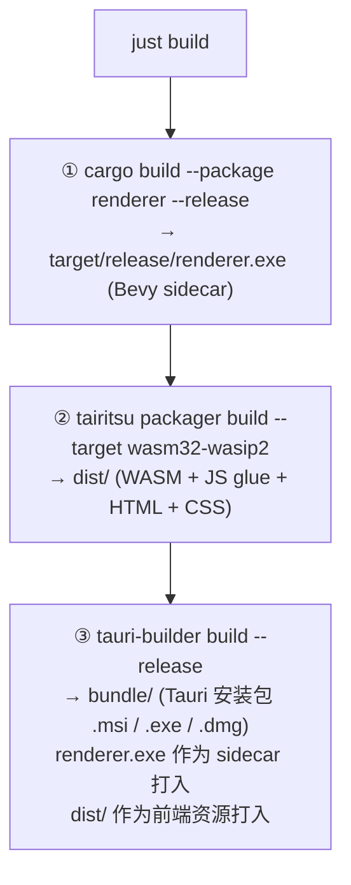
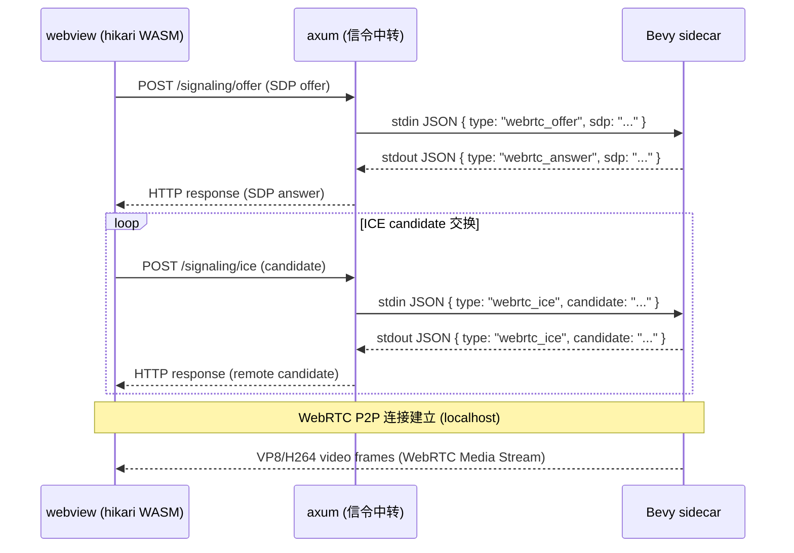
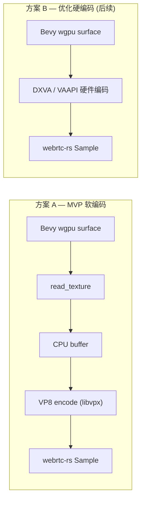

# 氢能走廊面板 — 场景 DEMO 实施计划

## 1. 项目概述

构建一个本地运行的场景演示程序：6 个立方体代表氢能走廊中的监测节点，高空俯瞰摄像机 + 鼠标选中方块弹出 2D 状态面板（温湿度），键盘移动视角（有限位），后端通过 WebSocket + JSON-RPC 实时推送传感器数据。

### 核心约束

| 项 | 选型 |
|---|---|
| 3D 渲染 | Bevy（本地 sidecar 进程，**不编译到 wasm32-unknown-unknown**） |
| 3D→前端传输 | WebRTC 实时推流（webrtc-rs） |
| 2D 面板前端 | hikari + tairitsu，编译为 WASM（`wasm32-wasip2`）在 Tauri webview 中运行 |
| 后端 | axum（与 Tauri 同进程） |
| 本地运行时 | Tauri |
| 构建系统 | justfile + tairitsu-packager + tauri-builder |

---

## 2. 架构总览



### 数据流





---

## 3. 项目目录结构

```
氢能走廊面板/
├── PLAN.md                          # 本文件
├── justfile                         # 构建入口
├── Cargo.toml                       # workspace 根
│
├── crates/
│   ├── shared/                      # 共享类型与协议定义
│   │   ├── Cargo.toml
│   │   └── src/
│   │       ├── lib.rs
│   │       ├── proto.rs             # JSON-RPC 协议类型
│   │       └── cube.rs              # CubeMetadata, SensorData 等
│   │
│   ├── server/                      # axum 后端（嵌入 Tauri）
│   │   ├── Cargo.toml
│   │   └── src/
│   │       ├── lib.rs               # pub async fn create_router()
│   │       ├── ws.rs                # WebSocket + JSON-RPC handler
│   │       ├── signaling.rs         # WebRTC 信令端点
│   │       ├── data.rs              # DataSource trait + MockDataSource
│   │       └── cubes.rs             # 方块元数据注册
│   │
│   └── renderer/                    # Bevy 渲染 sidecar（独立二进制）
│       ├── Cargo.toml
│       └── src/
│           ├── main.rs              # Bevy App 入口
│           ├── scene.rs             # 6 cubes + 调色 + 光照
│           ├── camera.rs            # 高空俯瞰摄像机 + 边界限制
│           ├── webrtc_stream.rs     # webrtc-rs 推流
│           ├── ipc.rs               # stdin/stdout JSON 指令收发
│           └── picking.rs           # 射线拾取（鼠标点击检测）
│
├── panel/                           # hikari + tairitsu 前端
│   ├── Cargo.toml                   # wasm32-wasip2 目标
│   └── src/
│       ├── lib.rs                   # WASM 入口，export lifecycle::start
│       ├── app.rs                   # 根组件
│       ├── components/
│       │   ├── video_player.rs      # WebRTC <video> 容器
│       │   ├── status_panel.rs      # 温湿度状态面板（hikari Card）
│       │   ├── trend_chart.rs       # 简易趋势图（Canvas）
│       │   └── keyboard_listener.rs # 键盘事件捕获
│       └── hooks/
│           ├── use_ws.rs            # WebSocket JSON-RPC 客户端 hook
│           └── use_selection.rs     # 方块选中状态管理
│
├── src-tauri/                       # Tauri 应用壳
│   ├── Cargo.toml
│   ├── tauri.conf.json
│   ├── capabilities/
│   │   └── default.json
│   └── src/
│       ├── main.rs                  # Tauri Builder，启动 axum + sidecar
│       ├── commands.rs              # Tauri commands（转发交互指令）
│       └── sidecar.rs               # Bevy sidecar 生命周期管理
│
└── dist/                            # tairitsu-packager 输出的前端静态资源
    └── (gitignored，由 just build-panel 生成)
```

---

## 4. Workspace Cargo.toml 依赖规划

### 根 `Cargo.toml`

```toml
[workspace]
resolver = "3"
members = [
    "crates/shared",
    "crates/server",
    "crates/renderer",
    "src-tauri",
    "panel",
]

[workspace.dependencies]
serde = { version = "1", features = ["derive"] }
serde_json = "1"
tokio = { version = "1", features = ["full"] }
axum = { version = "0.8", features = ["ws"] }
tower = "0.5"
tower-http = { version = "0.6", features = ["cors", "fs"] }
tracing = "0.1"
tracing-subscriber = "0.3"
uuid = { version = "1", features = ["v4"] }
chrono = "0.4"
rand = "0.9"

# bevy
bevy = "0.15"

# webrtc
webrtc = "0.13"

# tauri
tauri = "2"
tauri-builder = "0.2"  # 根据实际版本调整

# tairitsu / hikari (path 或 git 依赖)
tairitsu-web = { git = "https://github.com/celestia-island/tairitsu", branch = "dev" }
tairitsu-vdom = { git = "https://github.com/celestia-island/tairitsu", branch = "dev" }
tairitsu-hooks = { git = "https://github.com/celestia-island/tairitsu", branch = "dev" }
tairitsu-macros = { git = "https://github.com/celestia-island/tairitsu", branch = "dev" }
tairitsu-style = { git = "https://github.com/celestia-island/tairitsu", branch = "dev" }
hikari-components = { git = "https://github.com/celestia-island/hikari", branch = "dev" }
hikari-theme = { git = "https://github.com/celestia-island/hikari", branch = "dev" }
hikari-palette = { git = "https://github.com/celestia-island/hikari", branch = "dev" }
```

> **注意**：实际 path / git 引用方式以本地开发时的 monorepo 结构为准。如果 tairitsu 和 hikari 以本地路径引入，替换为 `path = "..."` 即可。

---

## 5. 各 Crate 详细设计

### 5.1 `crates/shared` — 共享协议类型

```rust
// src/proto.rs — JSON-RPC 消息类型
// ─────────────────────────────────────────

/// JSON-RPC 2.0 信封
pub struct JsonRpcEnvelope {
    pub jsonrpc: &'static str,          // "2.0"
    pub method: Option<String>,
    pub params: Option<serde_json::Value>,
    pub id: Option<u64>,
    pub result: Option<serde_json::Value>,
    pub error: Option<JsonRpcError>,
}

/// 后端 → 前端：传感器数据推送
/// method: "sensor.update"
pub struct SensorUpdateParams {
    pub cube_id: String,
    pub temperature: f64,
    pub humidity: f64,
    pub timestamp: i64,
}

/// 后端 → 前端：全部方块数据快照
/// method: "sensor.snapshot"
pub struct SensorSnapshotParams {
    pub cubes: Vec<CubeSensorData>,
}

// src/cube.rs — 方块与传感器数据模型
// ─────────────────────────────────────
pub struct CubeMetadata {
    pub id: String,
    pub label: String,
    pub position: [f32; 3],       // 3D 空间坐标
    pub color: [f32; 4],          // RGBA
}

pub struct CubeSensorData {
    pub id: String,
    pub label: String,
    pub temperature: f64,
    pub humidity: f64,
    pub timestamp: i64,
    pub history: Vec<SensorHistoryEntry>,  // 最近 N 条记录，用于趋势图
}

pub struct SensorHistoryEntry {
    pub timestamp: i64,
    pub temperature: f64,
    pub humidity: f64,
}

/// Bevy ← webview：移动指令
pub struct MoveCommand {
    pub direction: MoveDirection,
}

pub enum MoveDirection {
    Forward,
    Backward,
    Left,
    Right,
}

/// Bevy → webview：点击检测结果
pub struct PickResult {
    pub cube_id: Option<String>,
    pub screen_pos: [f32; 2],
}
```

### 5.2 `crates/server` — axum 后端

#### 5.2.1 `DataSource` trait（预留真实接入）

```rust
// src/data.rs
// ──────────────

#[async_trait]
pub trait DataSource: Send + Sync + 'static {
    /// 读取指定方块的传感器数据
    async fn read_sensor(&self, cube_id: &str) -> Option<CubeSensorData>;
    /// 读取所有方块传感器数据
    async fn read_all(&self) -> Vec<CubeSensorData>;
}

/// 模拟数据源：rand 生成温湿度
pub struct MockDataSource {
    cubes: Vec<String>,
}

impl MockDataSource {
    pub fn new(cube_ids: Vec<String>) -> Self { /* ... */ }
}

#[async_trait]
impl DataSource for MockDataSource {
    async fn read_sensor(&self, cube_id: &str) -> Option<CubeSensorData> {
        // 基于时间戳的确定性扰动 + rand 噪声
        // temperature: 20~35°C, humidity: 40~80%RH
    }
    async fn read_all(&self) -> Vec<CubeSensorData> { /* ... */ }
}

// 未来扩展：
// pub struct ModbusDataSource { ... }      // Modbus TCP/RTU
// pub struct MqttDataSource { ... }        // MQTT 订阅
// pub struct HttpDataSource { ... }        // HTTP 轮询
```

#### 5.2.2 WebSocket + JSON-RPC

```rust
// src/ws.rs
// ───────────

/// WebSocket 连接处理
/// 1. 建立连接后立即推送 sensor.snapshot
/// 2. 启动定时器，每 1s 推送 sensor.update（轮询各方块）
/// 3. 接收前端 JSON-RPC 请求（可选的 client→server 调用）
pub async fn ws_handler(
    ws: WebSocketUpgrade,
    State(state): State<AppState>,
) -> impl IntoResponse { /* ... */ }

/// AppState 持有 DataSource 的 Arc<dyn>
pub struct AppState {
    pub data_source: Arc<dyn DataSource>,
    pub cubes: Vec<CubeMetadata>,
}
```

#### 5.2.3 WebRTC 信令

```rust
// src/signaling.rs
// ───────────────────

/// POST /signaling/offer   → Bevy sidecar 的 SDP offer 透传
/// POST /signaling/answer  → 返回 SDP answer 给 webview
/// POST /signaling/ice     → ICE candidate 交换
///
/// 信令流程：
///   1. webview 通过 axum 创建 RTCPeerConnection → 生成 offer
///   2. offer 通过 HTTP POST 发给 axum → axum 转发给 Bevy sidecar
///   3. Bevy sidecar 返回 answer → axum 返回给 webview
///   4. 双方交换 ICE candidates
///
/// 实现细节：使用 tokio::mpsc 在 axum 和 sidecar manager 之间传递信令消息
```

### 5.3 `crates/renderer` — Bevy 渲染 sidecar

#### 5.3.1 场景构成

```rust
// src/scene.rs
// ──────────────

/// 6 个方块的布局（俯瞰视角下的排列）
/// 采用 2×3 网格布局，间距 3.0 单位：
///
///   [Cube0] [Cube1] [Cube2]     ← z = -3.0
///   [Cube3] [Cube4] [Cube5]     ← z =  3.0
///
/// 每个方块 1×1×1 大小，带不同颜色标识
/// 地面：灰色平面网格

/// 调色方案（使用中国传统色标识不同监测节点）
/// Cube0: 石青 (#1759A8)  — 节点 A
/// Cube1: 朱砂 (#FF461F)  — 节点 B
/// Cube2: 藤黄 (#FFB61E)  — 节点 C
/// Cube3: 葱倩 (#0EB83A)  — 节点 D
/// Cube4: 鹅黄 (#FFF143)  — 节点 E
/// Cube5: 靛蓝 (#065279)  — 节点 F

fn spawn_cubes(commands: &mut Commands) { /* ... */ }
fn spawn_ground(commands: &mut Commands) { /* ... */ }
fn spawn_lighting(commands: &mut Commands) { /* ... */ }
```

#### 5.3.2 摄像机控制

```rust
// src/camera.rs
// ─────────────────

/// 高空俯瞰摄像机：
///   - 初始位置: (0, 15, 10)，look_at (0, 0, 0)
///   - 键盘 WASD 控制平面平移
///   - 限位范围: x ∈ [-10, 10], z ∈ [-10, 10]
///   - 高度固定不变（纯 2D 平面移动）
///   - 移动速度: 5 units/s

const MOVE_SPEED: f32 = 5.0;
const BOUND_X: (f32, f32) = (-10.0, 10.0);
const BOUND_Z: (f32, f32) = (-10.0, 10.0);
const CAMERA_HEIGHT: f32 = 15.0;
const CAMERA_TILT: f32 = 0.588; // ≈ look_at offset

fn camera_movement_system(
    time: Res<Time>,
    ipc: Res<IpcChannel>,
    mut query: Query<&mut Transform, With<Camera>>,
) {
    // 从 IPC 读取 MoveCommand，应用位移，clamp 到边界
}
```

#### 5.3.3 WebRTC 推流



关键实现点：

1. 使用 Bevy 的 RenderWorld 提取渲染帧
2. 通过 wgpu 的 surface 读取像素数据
3. 编码为 VP8（先用软编 MVP，后续优化为硬编）
4. 通过 webrtc-rs 的 API 创建 VideoTrack 推送
5. 信令通过 stdin/stdout JSON 与 axum 中转

```rust
// src/webrtc_stream.rs — 系统函数签名

/// 系统：每帧捕获渲染输出并推送到 WebRTC track
fn capture_and_stream_system(
    // 使用 Bevy 的 ExtractSchedule 捕获帧
    // 推送到 webrtc-rs 的 SampleSender
)
```

#### 5.3.4 IPC 通信

```rust
// src/ipc.rs
// ───────────

/// Bevy sidecar 与 Tauri 主进程的 IPC 通道
///
/// 协议：stdin/stdout 交换 JSON 行
/// 每条消息一行，以 \n 结尾
///
/// 入站（stdin）:
///   {"type":"move","direction":"forward"}
///   {"type":"pick","screen_x":400.0,"screen_y":300.0}
///   {"type":"webrtc_offer","sdp":"..."}
///   {"type":"webrtc_ice","candidate":"..."}
///
/// 出站（stdout）:
///   {"type":"pick_result","cube_id":"cube_2","screen_x":400.0,"screen_y":300.0}
///   {"type":"webrtc_answer","sdp":"..."}
///   {"type":"webrtc_ice","candidate":"..."}
///   {"type":"ready"}  // Bevy 初始化完毕
///   {"type":"error","message":"..."}

pub struct IpcChannel {
    stdin_lines: Lines<BufReader<Stdin>>,
    stdout: BufWriter<Stdout>,
}

impl IpcChannel {
    pub fn new() -> Self { /* ... */ }
    pub fn read_command(&mut self) -> Option<IpcCommand> { /* ... */ }
    pub fn send_event(&mut self, event: IpcEvent) { /* ... */ }
}
```

#### 5.3.5 射线拾取

```rust
// src/picking.rs
// ────────────────

/// 鼠标点击 → 射线检测
///
/// 流程：
///   1. webview 捕获鼠标点击事件，记录视频元素内的相对坐标
///   2. 通过 Tauri command → stdin JSON 转发坐标给 Bevy
///   3. Bevy 将屏幕坐标转换为射线（使用摄像机参数）
///   4. 射线与 6 个方块的 AABB 做碰撞检测
///   5. 返回最近命中方块的 ID（或 None）
///
/// 注意：坐标映射需要考虑 webview <video> 元素的实际渲染尺寸
/// 与 Bevy 渲染分辨率的比例关系

fn pick_system(
    ipc: ResMut<IpcChannel>,
    cameras: Query<(&Camera, &GlobalTransform)>,
    cubes: Query<(Entity, &CubeId, &Aabb, &Transform)>,
) {
    // 从 IPC 读取 pick 命令，进行射线检测，返回结果
}
```

### 5.4 `panel/` — hikari + tairitsu 前端

> 编译目标：`wasm32-wasip2`，通过 `tairitsu-packager` 构建

#### 5.4.1 入口

```rust
// src/lib.rs
// ────────────

use tairitsu_macros::component;
use tairitsu_hooks::*;
use hikari_components::*;

#[component]
pub fn App() {
    // 1. 初始化 WebSocket 连接（连接 axum /ws）
    let ws = use_ws("ws://localhost:PORT/ws");
    // 2. 管理选中的方块
    let selection = use_selection();
    // 3. 管理 WebRTC 视频流
    let webrtc = use_webrtc();

    rsx! {
        div {
            class: "app-container",
            // WebRTC 视频层
            VideoPlayer {
                webrtc: webrtc.clone(),
                on_click: |pos| {
                    // 转发点击坐标给后端
                    selection.pick(pos);
                },
            }
            // 选中方块的状态面板（覆盖在视频上方）
            if let Some(cube_id) = selection.selected() {
                StatusPanel {
                    cube_id: cube_id.clone(),
                    data: ws.get_sensor_data(&cube_id),
                    on_close: move || selection.deselect(),
                }
            }
            // 键盘监听
            KeyboardListener {
                on_move: |dir| {
                    // 转发移动指令给后端
                    ws.send_move_command(dir);
                },
            }
        }
    }
}
```

#### 5.4.2 状态面板组件

```rust
// src/components/status_panel.rs
// ──────────────────────────────────

#[component]
pub fn StatusPanel(cube_id: String, data: CubeSensorData, on_close: Fn()) {
    let theme = use_theme();

    rsx! {
        div {
            class: "status-panel-overlay",
            // 使用 hikari Card 组件
            Card {
                class: "status-panel",
                elevation: 8,
                // 标题栏
                Header {
                    h3 { format!("{} 状态监测", data.label) }
                    IconButton {
                        icon: "close",
                        onclick: move |_| on_close(),
                    }
                }
                // 温湿度数值卡片
                div {
                    class: "metrics-row",
                    MetricCard {
                        label: "温度",
                        value: format!("{:.1}°C", data.temperature),
                        trend: compute_trend(&data.history, |h| h.temperature),
                        variant: if data.temperature > 30.0 { "warning" } else { "normal" },
                    }
                    MetricCard {
                        label: "湿度",
                        value: format!("{:.1}%RH", data.humidity),
                        trend: compute_trend(&data.history, |h| h.humidity),
                        variant: if data.humidity > 70.0 { "warning" } else { "normal" },
                    }
                }
                // 趋势折线图
                TrendChart {
                    history: data.history.clone(),
                }
                // 更新时间
                div {
                    class: "timestamp",
                    format!("更新于 {}", format_timestamp(data.timestamp)),
                }
            }
        }
    }
}
```

#### 5.4.3 WebSocket Hook

```rust
// src/hooks/use_ws.rs
// ──────────────────────

/// WebSocket JSON-RPC 客户端 hook
///
/// 职责：
///   - 维持 WebSocket 连接
///   - 解析 JSON-RPC notification (sensor.update / sensor.snapshot)
///   - 保存最新传感器数据到本地状态
///   - 提供发送 JSON-RPC request 的能力（移动指令等）
///
/// 使用 tairitsu-hooks 的 use_state / use_effect 实现
pub fn use_ws(url: &str) -> UseWsHandle {
    let data = use_state(HashMap<String, CubeSensorData>::new);
    let ws_ref = use_ref(|| None::<WebSocket>);

    use_effect(|| {
        // 建立 WebSocket 连接
        // 注册 onmessage 回调
        // 解析 JSON-RPC 消息
        // 更新 data 状态
    });

    UseWsHandle {
        data,
        send_move_command: |dir| { /* 发送 move JSON-RPC */ },
        send_pick: |pos| { /* 发送 pick JSON-RPC */ },
    }
}
```

### 5.5 `src-tauri/` — Tauri 应用壳

#### 5.5.1 main.rs

```rust
// src-tauri/src/main.rs
// ────────────────────────

fn main() {
    // 1. 创建 axum router（带 WebSocket + 信令 + 静态文件服务）
    let (router, shared_state) = create_router();

    // 2. 在 tokio 任务中启动 axum server（绑定随机或固定端口）
    let server_port = 18742;
    let addr = SocketAddr::from(([127, 0, 0, 1], server_port));

    // 3. 启动 axum server（作为后台任务）
    tokio::spawn(axum::serve(listener, router));

    // 4. 构建 Tauri 应用
    tauri::Builder::default()
        .manage(shared_state)
        .setup(|app| {
            // 启动 Bevy sidecar
            let sidecar = start_bevy_sidecar(app)?;
            app.manage(SidecarHandle(sidecar));
            Ok(())
        })
        .invoke_handler(tauri::generate_handler![
            commands::send_move_command,
            commands::send_pick_command,
            commands::get_server_url,
        ])
        .run(tauri::generate_context!())
        .expect("error while running tauri application");
}
```

#### 5.5.2 tauri.conf.json 关键配置

```jsonc
{
  "build": {
    "devUrl": "http://localhost:18742",  // 开发时指向 axum dev server
    "frontendDist": "../dist"             // 生产构建指向 tairitsu-packager 输出
  },
  "app": {
    "windows": [{
      "title": "氢能走廊监控面板",
      "width": 1280,
      "height": 800,
      "resizable": true,
      "fullscreen": false
    }],
    "security": {
      "csp": "default-src 'self'; connect-src ws://localhost:*; media-src *"
    }
  },
  "plugins": {
    "shell": {
      "sidecar": true,  // 允许启动 Bevy sidecar
      "scope": [{ "name": "binaries/renderer", "sidecar": true }]
    }
  }
}
```

---

## 6. 构建系统设计

### 6.1 justfile

```just
# ──────────────────────────────────────────────
# 氢能走廊面板 — 构建任务
# ──────────────────────────────────────────────

# 默认目标：开发模式运行
default: dev

# ── 开发 ──────────────────────────────────────

# 启动开发环境（热重载）
dev: build-renderer build-panel-dev
    cargo tauri dev

# 仅启动前端开发服务器（不含 Bevy sidecar）
dev-panel:
    cd panel && tairitsu dev --port 18742

# ── 构建 ──────────────────────────────────────

# 构建 Bevy 渲染器（native binary）
build-renderer:
    cargo build --package renderer --release

# 构建前端面板（WASM）
build-panel:
    cd panel && tairitsu packager build --target wasm32-wasip2 --output ../dist

# 构建前端面板（开发模式，带 HMR）
build-panel-dev:
    cd panel && tairitsu packager dev --target wasm32-wasip2 --output ../dist

# 构建 Tauri 应用（完整打包）
build: build-renderer build-panel
    tauri-builder build --release

# ── 检查 ──────────────────────────────────────

# 检查所有 crate 编译
check:
    cargo check --workspace
    cd panel && cargo check --target wasm32-wasip2

# 运行所有测试
test:
    cargo test --workspace

# 格式化代码
fmt:
    cargo fmt --all

# Clippy 检查
lint:
    cargo clippy --workspace -- -D warnings
    cd panel && cargo clippy --target wasm32-wasip2 -- -D warnings

# ── 清理 ──────────────────────────────────────

clean:
    cargo clean
    rm -rf dist/

# ── 依赖 ──────────────────────────────────────

# 检查依赖是否需要更新
outdated:
    cargo outdated
```

### 6.2 构建流水线



---

## 7. WebRTC 详细流程

### 7.1 连接建立



### 7.2 webrtc-rs 配置要点

```rust
// Bevy sidecar 端
use webrtc::api::APIBuilder;
use webrtc::peer_connection::configuration::RTCConfiguration;

let config = RTCConfiguration {
    ice_servers: vec![],  // 本地 localhost 不需要 STUN/TURN
    ..Default::default()
};

let api = APIBuilder::new().build();
let peer_connection = api.new_peer_connection(config).await?;

// 创建 Video Track
let video_track = api.new_track_from_codec(
    webrtc::media::io::ogg::ogg_reader::OggReader::new(/* ... */),
    webrtc::rtp_transceiver::rtp_codec::RTPCodecType::Video,
).await?;

peer_connection.add_track(video_track).await?;
```

### 7.3 帧捕获与编码



---

## 8. WebSocket JSON-RPC 协议规范

### 8.1 后端 → 前端（Notification）

#### `sensor.snapshot` — 全量快照（连接时推送）

```json
{
  "jsonrpc": "2.0",
  "method": "sensor.snapshot",
  "params": {
    "cubes": [
      {
        "id": "cube_0",
        "label": "节点 A",
        "temperature": 25.3,
        "humidity": 55.2,
        "timestamp": 1712345678,
        "history": [
          { "timestamp": 1712345618, "temperature": 25.1, "humidity": 55.0 },
          { "timestamp": 1712345628, "temperature": 25.2, "humidity": 55.1 }
        ]
      }
      // ... 6 个方块
    ]
  }
}
```

#### `sensor.update` — 增量更新（定时推送）

```json
{
  "jsonrpc": "2.0",
  "method": "sensor.update",
  "params": {
    "cube_id": "cube_3",
    "temperature": 28.7,
    "humidity": 62.1,
    "timestamp": 1712345688
  }
}
```

### 8.2 前端 → 后端（Request）

#### `input.move` — 移动摄像机

```json
{
  "jsonrpc": "2.0",
  "method": "input.move",
  "params": { "direction": "forward" },
  "id": 1
}
```

#### `input.pick` — 点击检测

```json
{
  "jsonrpc": "2.0",
  "method": "input.pick",
  "params": { "screen_x": 400.0, "screen_y": 300.0 },
  "id": 2
}
```

#### 返回值

```json
{
  "jsonrpc": "2.0",
  "result": { "cube_id": "cube_2", "screen_x": 400.0, "screen_y": 300.0 },
  "id": 2
}
```

---

## 9. 实施阶段划分

### Phase 1：骨架搭建（~2 天）

| 任务 | 说明 |
|---|---|
| 创建 workspace 结构 | 按目录结构创建所有 crate |
| shared 协议类型 | 定义 proto / cube 模块 |
| justfile 编写 | 所有构建目标 |
| Cargo.toml 依赖配置 | 所有 workspace dependencies |
| Tauri 空壳 | 能启动、显示空白 webview |

### Phase 2：Bevy 3D 场景（~2 天）

| 任务 | 说明 |
|---|---|
| 6 个方块 + 地面 + 光照 | scene.rs |
| 高空摄像机 + 键盘移动 + 限位 | camera.rs |
| IPC 通道 | ipc.rs（stdin/stdout JSON） |
| 独立运行测试 | renderer 可单独 `cargo run`，命令行控制移动 |

### Phase 3：axum 后端 + 数据推送（~2 天）

| 任务 | 说明 |
|---|---|
| DataSource trait + MockDataSource | data.rs |
| WebSocket JSON-RPC handler | ws.rs |
| 静态文件服务（托管 dist/） | 集成到 router |
| Bevy sidecar 管理 | 启动/停止/IPC 桥接 |

### Phase 4：WebRTC 推流（~3 天） ⭐ 关键路径

| 任务 | 说明 |
|---|---|
| Bevy 帧捕获 | 从 wgpu surface 读取像素 |
| VP8 编码 | libvpx 软编码 |
| webrtc-rs PeerConnection | 创建 track + 推流 |
| 信令流程 | axum 中转 offer/answer/ICE |
| 前端 `<video>` 接收 | hikari VideoPlayer 组件 |

### Phase 5：hikari 2D 面板（~3 天）

| 任务 | 说明 |
|---|---|
| tairitsu-packager 配置 | panel/ 的构建配置 |
| WebSocket JSON-RPC hook | use_ws.rs |
| StatusPanel 组件 | 温湿度卡片 + 告警色 |
| TrendChart 组件 | Canvas 趋势图 |
| 鼠标点击 → 方块选择 → 面板弹出 | pick 流程联调 |
| 键盘监听 → 移动指令 | KeyboardListener |

### Phase 6：集成联调 & 打包（~2 天）

| 任务 | 说明 |
|---|---|
| Tauri 集成 | Bevy sidecar + axum + webview 串联 |
| tauri-builder 打包 | 生成安装包 |
| 端到端测试 | 完整流程走通 |
| 性能调优 | 帧率、延迟优化 |

**总计预估：~14 天**

---

## 10. 风险与注意事项

### 10.1 WebRTC 帧捕获

- Bevy 默认使用 wgpu 渲染，获取帧数据需要访问 `RenderWorld`
- MVP 方案使用 `read_texture` 回读 CPU，会有一定延迟（~50ms）
- 后续可考虑 DXVA 硬件编码或 NVIDIA Video Codec SDK
- 本地 localhost WebRTC 延迟极低，不需要 STUN/TURN

### 10.2 tairitsu WASM 与 Tauri webview 兼容性

- tairitsu 编译目标是 `wasm32-wasip2`，需要确认 Tauri webview 的 WASM 运行时支持
- 可能需要 tairitsu-packager 生成标准的浏览器 WASM 加载器（JS glue）
- tairitsu-ssr 可作为降级方案：服务端渲染 HTML，客户端仅做事件绑定

### 10.3 坐标映射

- webview 中 `<video>` 元素的实际显示尺寸与 Bevy 渲染分辨率可能不同
- 点击坐标需要按比例映射：`bevy_x = (click_x / video_width) * render_width`
- 需要处理 DPI 缩放（Windows 上 125%/150% 等）

### 10.4 Bevy sidecar 生命周期

- Bevy 进程必须在 Tauri 退出时正确清理
- WebRTC 连接断开时需要优雅关闭
- 使用 Tauri 的 `shell-sidecar` 插件管理子进程

### 10.5 构建工具链

- `tairitsu-packager` 需要 `wasm32-wasip2` target：`rustup target add wasm32-wasip2`
- `tauri-builder` 需要 Tauri CLI：`cargo install tauri-cli`
- Bevy 渲染器需要平台图形依赖（Windows: DirectX / Vulkan）

---

## 11. 6 个监测节点定义

| ID | 标签 | 3D 位置 | 颜色 | 模拟温度范围 | 模拟湿度范围 |
|---|---|---|---|---|---|
| cube_0 | 节点 A | (-3, 0.5, -3) | 石青 #1759A8 | 22~28°C | 50~65% |
| cube_1 | 节点 B | (0, 0.5, -3) | 朱砂 #FF461F | 25~35°C | 40~60% |
| cube_2 | 节点 C | (3, 0.5, -3) | 藤黄 #FFB61E | 20~26°C | 55~75% |
| cube_3 | 节点 D | (-3, 0.5, 3) | 葱倩 #0EB83A | 24~30°C | 45~55% |
| cube_4 | 节点 E | (0, 0.5, 3) | 鹅黄 #FFF143 | 18~24°C | 60~80% |
| cube_5 | 节点 F | (3, 0.5, 3) | 靛蓝 #065279 | 26~32°C | 35~50% |

> Y 轴 0.5 使方块半浮于地面（方块尺寸 1×1×1，中心在 y=0.5）
